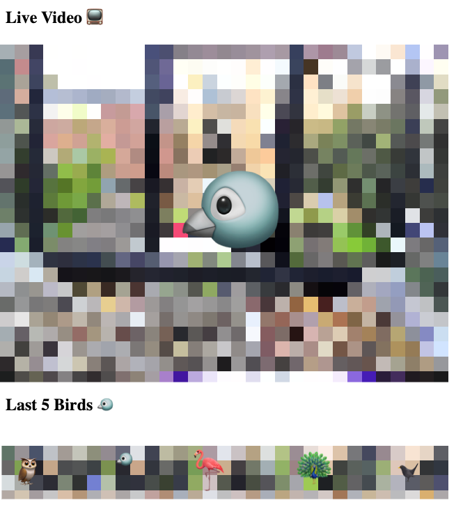

# BirdCam

A simple Flask web app for displaying birds identified on a webcam, with a live feed of the webcam and previous instances of motion detected.

  

This uses a single produce multiple consumer interface to the singleton webcam class (using OpenCV), so that motion detection, classification, etc, can be done at the same time as displaying the webcam on the Flask site.
