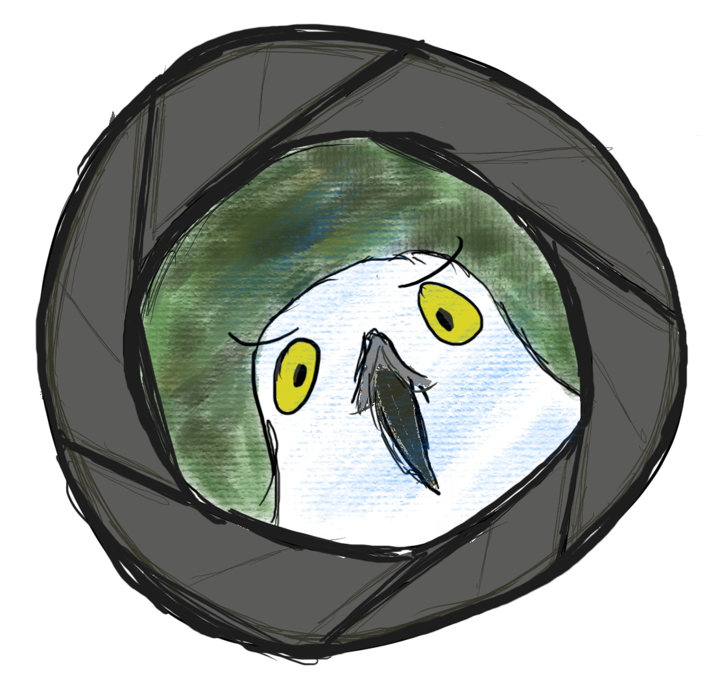

<p align="center">
  
</p>

# Bird, interrupted

A simple Flask web app for displaying birds identified on a webcam, with a live feed of the webcam and previous instances of motion detected.

<p align="center">
  
</p>

To try and minimise false positives, vanilla `MobileNetV3` model predictions are used to determine whether the object in the frame is a bird or a neighbour out for a 3am stroll in their pyjamas. This works surprisingly well, but seems to be better at identifying bird butts compared to bird faces. More R&D is required.

The web app uses a single-producer multiple-consumer interface to the singleton webcam class (using OpenCV), so that motion detection, classification, etc, can be done at the same time as displaying the webcam on the Flask site.

Bird ID
---

A separate custom version of the `MobileNetV3` model is used to identify the bird species in the image. For inference speed, the quantised `torchvision` version of the model is used (which is probably not necessary: Raspberry Pis are fast and birds are slow). This is fine-tuned with quantisation-aware training on the [Kaggle birds dataset](https://www.kaggle.com/datasets/gpiosenka/100-bird-species).

Usage
---

The web app itself is located in `birdCam/web/birdapp.py`, I run it with

```python
nohup python birdapp.py &
```

but anyone with a greater sense of self preservation should run it using a properly configured web server.

Model
---

A trained model for robins, sparrows, and blue tits can be found [here](https://public-dpo.s3.us-east-1.amazonaws.com/model.pth). This achives an average F1 score of 0.967.
